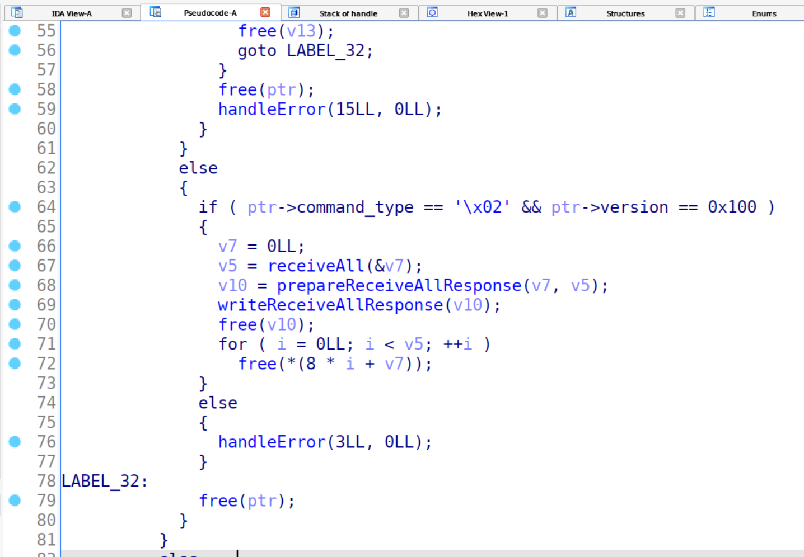
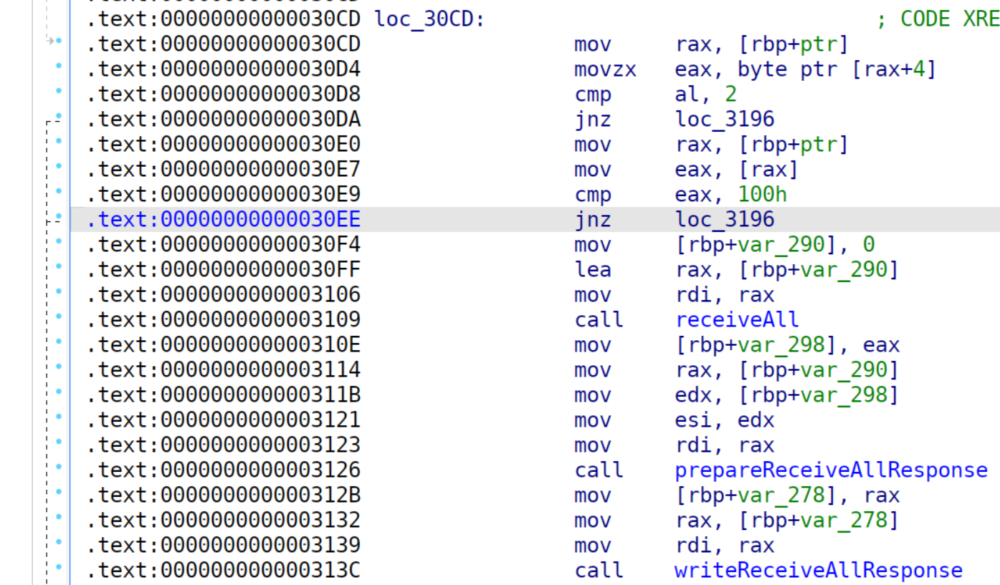
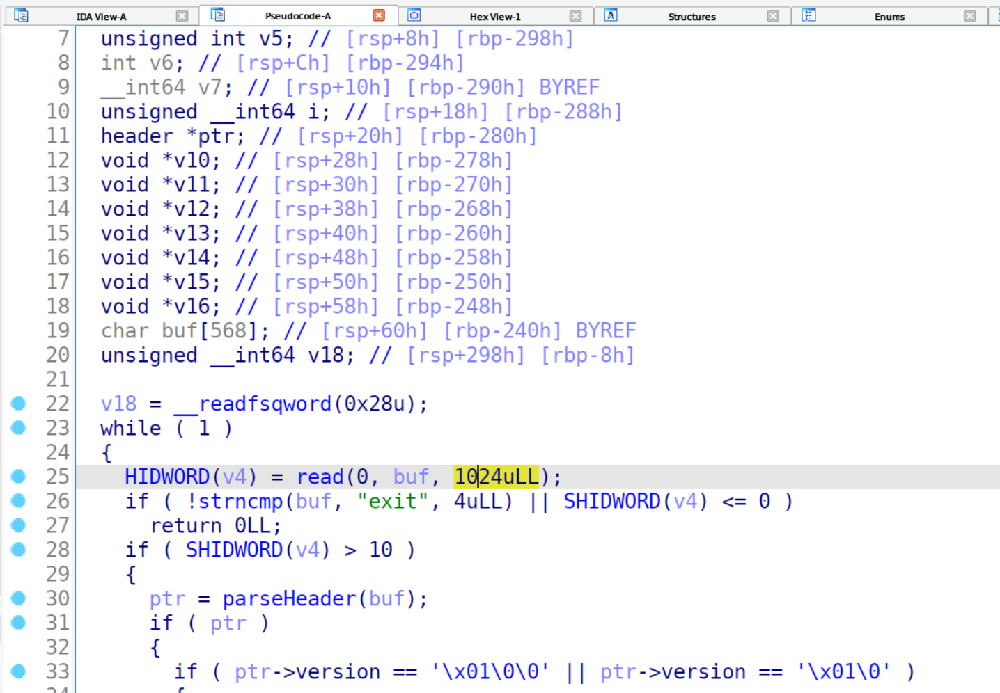
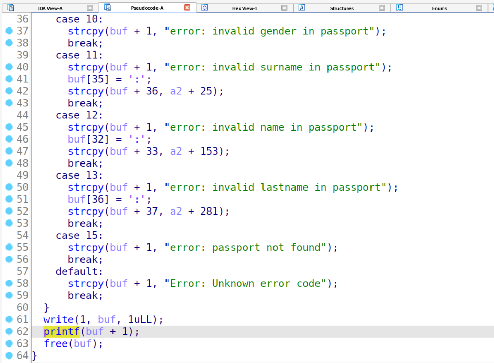
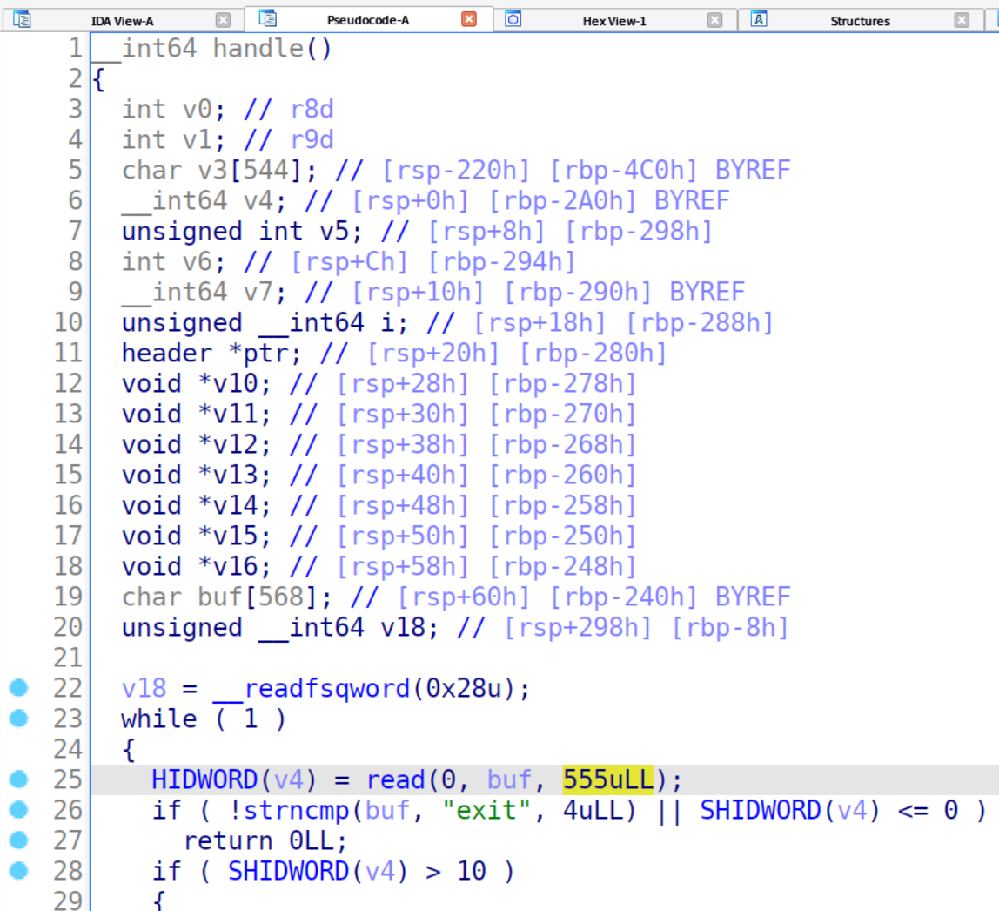

# Writeup

## RECEIVE_ALL позволяет получить все паспорта

### Уязвимость

При использовании версии протокола 0.1.0 появляется возможность использовать метод RECEIVE_ALL, который получает все паспорта без какого-либо подтверждения.

Уязвимый код
```c++
else if (header->type == RECEIVE_ALL && header->version == PROTOCOL_VERSION_0_1_0) {
    passport_t** passports = NULL;
    uint32_t countPassports = receiveAll(&passports);
    receive_all_response_t* response = prepareReceiveAllResponse(passports, countPassports);
    writeReceiveAllResponse(response);
    free(response);
    for (size_t i = 0; i < countPassports; i++) {
        free(passports[i]);
    }
}
```

Этот же код в декомпиляторе:


Пример эксплойта находится [здесь](sploits/sploit1.py).

### Патч

Необходимо выпилить функционал получения всех паспортов.
Для этого можно инструкцию jnz поменять на jmp, чтобы программа никогда не зашла в if:


## Переполнение буфера + форматированная строка

### Уязвимость

1. Переполнение буфера в функции handle

Исходный код:


Код в декомпиляторе:


2. Форматрованная строка в функции handleError

Исходный код:


Код в декомпиляторе:


При помощи второго примитива получаем адрес libc и канарейку
При помощи первого примитива получаем ROP

Далее можем вызвать system и получить шелл

Пример эксплойта находится [здесь](sploits/sploit2.py).

### Патч

1. Сокращаем ввод до размера буфера
```c
int packetLen = read(0, buffer, HEADER_LENGTH+BODY_LENGTH);
```


2. Вместо форматированной строки можно использовать fputs
```c
fputs(response->message, stdout);
```
